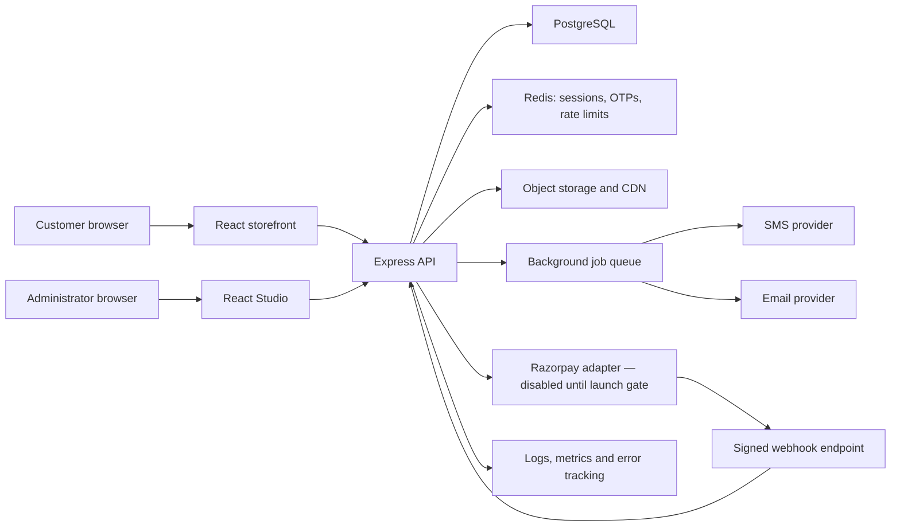

# The IIT Delhi Drop — PostgreSQL Commerce Evolution Pipeline

**Document status:** Implementation-ready  
**Primary stack:** React, Anime.js, Node.js, Express.js, PostgreSQL  
**Target:** A responsive, secure commerce core with an embedded homepage catalogue, phone authentication, accounts and orders, customizable merchandise, verified reviews, and Razorpay-ready payment records.

---

## 1. Confirmed product decisions

The implementation must follow these decisions unless they are explicitly revised:

1. Replace SQLite and SQL.js completely with PostgreSQL.
2. Retain Node.js and Express.js for the backend.
3. Keep the main catalogue on the homepage at `/#catalog`; do not create a dedicated `/shop` route.
4. Retain individual product routes at `/products/:slug`.
5. On phones, load only four catalogue products initially and reveal four more per batch.
6. Add catalogue filters for category, product type, size, availability, customization availability, and price.
7. Add sorting by featured, newest, price, best-selling, and rating.
8. Fix catalogue state and category switching before adding new catalogue animations.
9. Build a custom accessible hamburger drawer animated with Anime.js.
10. Do not introduce Bootstrap by default. Use it only if a documented accessibility or layout issue cannot be solved cleanly with the existing design system.
11. Implement customer login and registration using phone-number OTP.
12. Keep customer and administrator authentication separate.
13. Ask for hostel only when the customer is a current student and currently resides in an IIT Delhi hostel.
14. Keep affiliation/profile information separate from shipping addresses.
15. Allow verified purchasers to review delivered products.
16. Permit a one-to-five-star rating, a written review of up to 400 words, and up to three images.
17. Add product-level name/nickname customization with Studio-controlled rules.
18. Do not implement a usable wallet now. Preserve wallet-compatible payment and ledger boundaries for a later release.
19. Keep Razorpay charging disabled until merchant credentials, signed webhooks, reconciliation, refunds, and controlled payment testing are complete.

---

## 2. Scope

### Included

- PostgreSQL schema, migrations, seed data, indexes, constraints, and backup/restore procedure
- Migration of existing catalogue, variant, coupon, theme, order, and Studio data
- Homepage catalogue API and responsive interface
- Reliable category/filter/sort switching
- Phone-optimized catalogue batching
- Anime.js mobile navigation and lightweight phone interactions
- Customer OTP registration and login
- Conditional affiliation and hostel profile fields
- Saved delivery addresses
- Customer account and My Orders
- Product customization
- Verified-purchase reviews and secure review-image uploads
- Studio controls for customers, reviews, customization, inventory, and order details
- Payment idempotency and webhook-ready records
- Wallet-compatible schema boundary without balance or spending functionality
- Security, observability, testing, CI/CD, deployment, rollback, and launch gates

### Explicitly excluded from this release

- A dedicated `/shop` route
- A live internal wallet
- Wallet balances, wallet payments, or promotional wallet credit
- Live Razorpay charging before the payment launch gate
- Native mobile applications
- Marketplace or multi-vendor functionality
- Loyalty points and referrals
- Automated return approval
- Unmoderated public reviews
- Mandatory hostel details for all customers

---

## 3. Target architecture



### Backend layering

```text
HTTP routes
  → request validation
  → authentication and authorization
  → application services
  → PostgreSQL repositories
  → domain events/background jobs
  → response serializers
```

Routes must not contain raw business logic. Inventory, coupons, orders, reviews, customizations, OTP verification, and payments each receive a dedicated service.

### Recommended backend packages

- `pg` for PostgreSQL pooling and parameterized queries
- `node-pg-migrate` for versioned SQL migrations
- A schema-validation library for every request and environment variable
- A Redis client for OTP challenges, sessions, cooldowns, and distributed rate limits
- An image-processing library for safe resizing and metadata removal
- A structured logging library with request correlation identifiers

Package versions must be pinned and committed through the lockfile.

---

## 4. PostgreSQL data model

All money values use integer paise. All important timestamps use `TIMESTAMPTZ`. Publicly exposed entities use UUIDs. Every table includes `created_at`; mutable records include `updated_at`.

### 4.1 Identity and profile

#### `users`

- `id UUID PRIMARY KEY`
- `phone_e164 TEXT UNIQUE NOT NULL`
- `phone_verified_at TIMESTAMPTZ`
- `full_name TEXT NOT NULL`
- `email TEXT NULL`
- `affiliation ENUM(student, faculty_staff, alumni, visitor_other)`
- `is_hostel_resident BOOLEAN NOT NULL DEFAULT FALSE`
- `hostel_id UUID NULL`
- `room_number TEXT NULL`
- `status ENUM(active, suspended, deleted)`
- `last_login_at TIMESTAMPTZ`

Constraint: `hostel_id` is allowed only when affiliation is `student` and `is_hostel_resident` is true.

#### `hostels`

- `id UUID PRIMARY KEY`
- `name TEXT UNIQUE NOT NULL`
- `active BOOLEAN NOT NULL DEFAULT TRUE`
- `sort_order INTEGER`

#### `addresses`

- `id UUID PRIMARY KEY`
- `user_id UUID REFERENCES users`
- `label TEXT`
- `recipient_name TEXT`
- `phone_e164 TEXT`
- `line_1 TEXT`
- `line_2 TEXT NULL`
- `landmark TEXT NULL`
- `city TEXT`
- `state TEXT`
- `postal_code TEXT`
- `country_code TEXT DEFAULT 'IN'`
- `is_default BOOLEAN`

Delivery addresses never depend on affiliation or hostel fields.

#### `customer_sessions`

- Store a hash of the session identifier, not the raw cookie value
- `user_id`, `created_at`, `last_seen_at`, `expires_at`, `revoked_at`
- Optional device description and coarse security metadata

#### `otp_challenges`

Production OTP challenges should live in Redis with:

- Hashed OTP value
- Phone number
- Purpose: registration, login, sensitive action
- Five-minute TTL
- Attempt count
- Resend count and cooldown
- Single-use state

PostgreSQL stores only non-sensitive audit outcomes, never OTP values.

### 4.2 Catalogue and inventory

#### `categories`

- UUID, name, slug, description, active, sort order

#### `product_types`

- UUID, name, slug, attribute definition, active

Examples: T-shirt, Hoodie, Trackpants, Cap, Tote, Mug.

#### `products`

- UUID, category ID, product-type ID
- Name, slug, short description, full description
- Base price, compare-at price
- Status: draft, active, archived
- Featured flag and sort order
- Rating average and approved-review count as maintained aggregates
- Search document if full-text search is introduced

#### `product_media`

- Product ID, storage key, media type, alt text, sort order
- Width, height, blur placeholder, publication state

#### `product_variants`

- UUID, product ID, SKU
- Size, colour
- Price override nullable
- Stock on hand
- Reserved stock
- Active state
- Unique `(product_id, size, colour)`
- Unique SKU

Available stock is `stock_on_hand - reserved_stock`.

#### `inventory_movements`

- Variant ID
- Type: receipt, reservation, release, sale, return, correction
- Quantity delta
- Order reference nullable
- Administrator reference nullable
- Idempotency key
- Reason and timestamp

Inventory must be auditable; Studio must not silently overwrite stock without producing a movement.

### 4.3 Orders, coupons, and payments

#### `carts` and `cart_items`

- Persist authenticated carts server-side
- Retain guest cart locally and merge it after login
- Cart items reference exact variants
- Customization draft stored with the cart item

#### `coupons` and `coupon_redemptions`

- Coupon code, type, value, minimum order, start/end dates
- Usage limits per coupon and per customer
- Active state
- Redemptions linked to user and order

Coupon eligibility and redemption occur within the order transaction.

#### `orders`

- UUID and human-readable order number
- User ID
- Immutable shipping-address snapshot
- Subtotal, customization total, discount, shipping, tax, grand total
- Currency
- Order state and payment state
- Fulfilment state
- Source and timestamps

#### `order_items`

- Order ID, product ID, variant ID
- Immutable product name, SKU, size, colour, image, unit price
- Quantity and line total
- Fulfilment state
- Review eligibility state

#### `payment_attempts`

- Order ID
- Provider
- Provider order/payment references
- Amount and currency
- State
- Idempotency key unique
- Created and updated timestamps

#### `payment_webhook_events`

- Provider event ID unique
- Signature validation outcome
- Event type
- Payload or encrypted/limited payload according to retention policy
- Processing state, attempts, and timestamps

Duplicate webhook events must not duplicate payment or order transitions.

#### Wallet-ready boundary

Reserve table names and service interfaces for `wallet_accounts` and `wallet_ledger_entries`, but do not expose endpoints, balances, Studio buttons, or checkout options in this release.

### 4.4 Customization

#### `product_customization_options`

- Product ID
- Enabled state
- Customer-facing field label
- Minimum/maximum character count
- Allowed-character rule
- Allowed placements
- Allowed fonts/styles
- Allowed text colours
- Surcharge
- Added fulfilment days
- Preview coordinates and safe region
- Return-policy acknowledgement

#### `order_item_customizations`

- Order-item ID
- Submitted text
- Selected placement, font/style, and colour
- Price surcharge
- Immutable rule snapshot
- Production state and moderation state

Changing a product later must not change a placed order's customization.

### 4.5 Reviews

#### `reviews`

- UUID, user ID, product ID, order-item ID unique
- Rating constrained to 1–5
- Optional title
- Body with a server-enforced 400-word maximum
- Status: pending, approved, rejected, flagged
- Moderation reason and moderator
- Submitted, edited, moderated timestamps

Only delivered, owned order items are eligible.

#### `review_media`

- Review ID
- Storage key
- Safe MIME type
- Width and height
- Sort order constrained to 1–3
- Processing and moderation state

Images are stored in object storage, not PostgreSQL.

### 4.6 Required indexes

- Active products by category and sort order
- Active products by product type and sort order
- Variants by product, size, active, and available-stock query path
- Products by effective price
- Orders by user and creation date
- Orders by fulfilment/payment state and creation date
- Reviews by product, approved status, and creation date
- Sessions by user and expiry
- Coupon code unique index and active-period lookup
- Webhook provider-event unique index
- Inventory movement by variant and creation date

Use query plans to validate indexes against real catalogue and report queries before launch.

---

## 5. API contracts

All mutation endpoints require validation, authentication where applicable, CSRF protection for cookie-authenticated browser requests, and consistent error shapes.

### 5.1 Public catalogue

```text
GET /api/catalog
  ?category=apparel
  &type=hoodie
  &size=M
  &available=true
  &customizable=true
  &minPrice=50000
  &maxPrice=300000
  &sort=price_asc
  &limit=4
  &cursor=opaque_cursor

GET /api/products/:slug
GET /api/products/:slug/reviews?sort=newest&cursor=...
```

Catalogue responses include:

- Products matching an active in-stock variant
- Available filter facets and counts
- Opaque next cursor
- Applied filters
- Request identifier

### 5.2 Phone authentication

```text
POST /api/auth/otp/request
POST /api/auth/otp/verify
POST /api/auth/logout
POST /api/auth/logout-all
GET  /api/account/session
PATCH /api/account/profile
```

OTP request responses must not reveal whether a phone number already exists.

### 5.3 Addresses and account

```text
GET    /api/account/addresses
POST   /api/account/addresses
PATCH  /api/account/addresses/:id
DELETE /api/account/addresses/:id
GET    /api/account/orders?cursor=...
GET    /api/account/orders/:id
```

Every order query verifies ownership.

### 5.4 Cart and order quote

```text
GET    /api/cart
POST   /api/cart/items
PATCH  /api/cart/items/:id
DELETE /api/cart/items/:id
POST   /api/cart/merge
POST   /api/checkout/quote
POST   /api/orders
```

The server recalculates variants, customization surcharges, coupon eligibility, shipping, and totals. Client-supplied totals are never trusted.

### 5.5 Reviews

```text
GET  /api/account/review-eligibility
POST /api/reviews
PATCH /api/reviews/:id
POST /api/reviews/:id/media/presign
POST /api/reviews/:id/media/complete
```

Studio:

```text
GET   /api/admin/reviews?status=pending&rating=...
PATCH /api/admin/reviews/:id/moderation
```

### 5.6 Studio catalogue and customization

```text
POST/PATCH /api/admin/products
POST/PATCH /api/admin/products/:id/variants
POST/PATCH /api/admin/products/:id/customization
GET        /api/admin/inventory/movements
POST       /api/admin/inventory/adjustments
```

Inventory adjustments require an explanation and create an audit record.

### 5.7 Payment boundary

```text
POST /api/payments/razorpay/order      — disabled until configured
POST /api/webhooks/razorpay            — signature required
POST /api/admin/orders/:id/refund       — disabled until launch gate
```

The checkout interface must clearly show demo mode until all payment launch gates pass.

---

## 6. Frontend modules and behaviour

### 6.1 Homepage catalogue

The catalogue is a self-contained homepage module, not a separate route.

Required components:

- `CatalogueSection`
- `CategoryChips`
- `DesktopFilterBar`
- `MobileFilterSheet`
- `SortMenu`
- `ProductGrid`
- `ProductCard`
- `ProductSkeleton`
- `LoadMoreButton`
- `EmptyCatalogueState`
- `CatalogueErrorState`

State rules:

- Filter state has a single source of truth.
- Filter state is serialized to `/` query parameters.
- Changing filters resets the cursor and page.
- Only the latest request may update the grid.
- Previous results remain visible until the next response succeeds.
- Back navigation restores filters and scroll position.
- Loading, empty, error, and retry states are explicit.

Phone behaviour:

- Four products initially
- Four additional products per request
- Sticky Filter and Sort actions
- Two-column cards where content remains legible
- Single-column layout below the defined narrow breakpoint
- Filter sheet with Apply, Clear all, and active-count indicators
- No full-grid exit animation during filter changes

### 6.2 Product page

Extend existing product pages with:

- Rating summary beside the title
- Review count linked to the review section
- Size and colour availability
- Customization interface when enabled
- Character counter
- Placement/style/colour selections
- Customization price and fulfilment-time explanation
- Cart confirmation animation
- Mobile sticky purchase control
- Review summary, gallery, filters, and pagination

### 6.3 Animated mobile navigation

Use Anime.js for:

- Hamburger-to-X line morph
- Drawer translation
- Backdrop opacity
- Staggered link and account/cart affordance entry
- Reversed close sequence

Interaction requirements:

- Ignore or safely reverse rapid repeated taps
- Trap focus while open
- Close on Escape, backdrop click, and selected navigation link
- Restore focus to the trigger after closing
- Lock background scrolling
- Set `aria-expanded`, `aria-controls`, and an accessible drawer label
- Skip choreography when `prefers-reduced-motion` is enabled

### 6.4 Customer authentication

Required screens/components:

- Phone entry
- OTP verification with auto-advance and paste support
- Resend timer
- Registration/profile completion
- Affiliation selector
- Conditional hostel-residency question and hostel selector
- Delivery-address editor
- Session/device management
- Return-to-checkout continuation

Hostel fields remain hidden and unrequired for alumni, faculty/staff, visitors, non-resident students, and external shipping addresses.

### 6.5 My Account and My Orders

- Profile and verified phone
- Saved addresses
- Orders sorted newest first
- Order status timeline
- Item-level variant and customization information
- Delivery tracking link when available
- Review eligibility and review status
- Review submission/editing entry point
- Logout and logout-all-devices

### 6.6 Review composer

- Star rating required
- Optional title
- Body word counter with 400-word maximum
- Maximum three images
- Image previews and removal
- Upload progress and retry
- Submission moderation notice
- Existing-review state and edit rules

### 6.7 Studio additions

Add navigation areas for:

- Customers
- Review moderation
- Inventory movements
- Customization configuration
- OTP/SMS delivery health without exposing OTP values
- Payment/webhook readiness

Order details must prominently display customization instructions and production status.

---

## 7. Animation and performance policy

Animation is permitted only when it communicates navigation, selection, hierarchy, feedback, or spatial continuity.

### Phone motion budget

- Most interactions: 180–350 ms
- Use transforms and opacity
- At most one primary transition and one small feedback effect concurrently
- Avoid continuous parallax and blurred animated layers
- Stop or reverse interrupted animations
- Never leave content hidden when animation initialization fails
- Reduced-motion mode must preserve every action and state change

### Catalogue performance budgets

- Four initial products on phones; 12 on larger screens
- No request for images outside the immediate viewport without lazy loading
- Product thumbnail target: under 100 KB where visual quality permits
- Hero image supplied in responsive sizes
- Prevent cumulative layout shift using image dimensions/aspect ratios
- Catalogue filter response target: p95 under 400 ms excluding unusually slow networks
- Interaction response target: visual acknowledgement within 100 ms
- No main-thread task above 50 ms during ordinary filter switching
- Lighthouse mobile targets before launch:
  - Performance: 85+
  - Accessibility: 95+
  - Best Practices: 95+
  - SEO: 90+

Anime.js scopes must clean up on component unmount. Catalogue animations run only after a successful response and never control whether content is fundamentally visible.

---

## 8. Authentication and authorization controls

### Customer authentication

- Cryptographically secure OTP generation
- Hash OTPs with a server-side secret before storage
- Five-minute TTL
- Single use
- Strict attempt and resend limits
- Invalidate previous OTP on resend
- Never log OTP values
- Generic request/verification responses
- Rate limits by normalized phone, IP, session, and device signal
- Secure, HttpOnly, SameSite cookie
- Secure flag in every non-local environment
- Rotate session after successful authentication
- Store only session hashes server-side
- CSRF protection on mutations
- Logout one/all sessions
- Session expiry and inactivity expiry

### Administrator authentication

- Separate user population and route boundary
- Argon2id password hashing
- TOTP or passkey second factor before production
- Role-based permissions
- Shorter session lifetime
- Reauthentication for refunds, role changes, exports, and security settings
- Login alert and audit events

### Authorization

- Deny by default
- Ownership checks for addresses, orders, reviews, and uploads
- Verified-purchase check for reviews
- Role/permission checks for every Studio mutation
- No sensitive fields in public serializers

---

## 9. Review-image security pipeline

1. Authenticated customer requests a short-lived upload authorization.
2. Server verifies review eligibility and the three-image limit.
3. Client uploads directly to private object storage.
4. Completion endpoint records the upload as `processing`.
5. Background worker validates real MIME type and dimensions.
6. Reject disallowed formats and oversize files.
7. Strip EXIF/location metadata.
8. Resize and generate optimized derivatives.
9. Run malware/safety checks supported by the hosting environment.
10. Publish only after image processing and review moderation pass.

Do not trust file extensions or request `Content-Type`. Generate storage keys and never use customer filenames as public paths.

---

## 10. Order, inventory, and customization transaction

Order creation must execute in a PostgreSQL transaction:

1. Lock or safely validate each selected variant.
2. Confirm active product and sufficient available stock.
3. Validate customization against the product's current rules.
4. Validate coupon eligibility and usage limits.
5. Calculate every amount on the server.
6. Create order and immutable address snapshot.
7. Create order items and customization snapshots.
8. Reserve inventory and record inventory movements.
9. Reserve coupon redemption.
10. Create a payment attempt using an idempotency key.
11. Commit.
12. Start external payment only after commit.

On payment failure or expiry, release reservations idempotently. A retry must never create duplicate orders, stock deductions, or coupon redemptions.

---

## 11. Delivery phases

### Phase 0 — Baseline and bug reproduction

**Duration:** 2–3 days  
**Goal:** Capture the current behaviour before structural changes.

Tasks:

- Record all existing routes and Studio capabilities
- Reproduce category-switch break on desktop and phone
- Capture console, network, animation, and state-transition evidence
- Record current catalogue timings and image sizes
- Export SQLite data and retain a checksum-protected backup
- Freeze schema-changing feature work

Exit criteria:

- Catalogue bug has a documented reproduction
- Existing data export is restorable
- Critical user journeys have baseline tests

### Phase 1 — PostgreSQL foundation

**Duration:** 1 week  
**Dependencies:** Phase 0

Tasks:

- Provision local and hosted PostgreSQL environments
- Add connection pool and environment validation
- Add migration framework
- Create schema, constraints, indexes, and seed migration
- Build repository layer
- Convert prices, timestamps, identifiers, and booleans safely
- Write SQLite-to-PostgreSQL import utility
- Validate row counts, totals, SKUs, stock, coupons, and settings
- Add backup and restore runbook

Exit criteria:

- Application starts with PostgreSQL only
- No SQL.js or SQLite runtime dependency remains
- Fresh migrations and rollback work in CI
- Migrated data reconciliation passes

### Phase 2 — Catalogue API and state repair

**Duration:** 1 week  
**Dependencies:** Phase 1

Tasks:

- Implement indexed catalogue query and cursor pagination
- Implement filter facets
- Centralize frontend catalogue state
- Add request cancellation and stale-response protection
- Preserve previous results during filtering
- Add loading, retry, empty, and error states
- Remove animations that control base visibility
- Add query-parameter and scroll restoration

Exit criteria:

- Rapidly changing categories cannot break or blank the grid
- Every filter combination has deterministic results
- Out-of-order responses cannot overwrite current selection
- Refresh/back navigation restores catalogue state

### Phase 3 — Responsive catalogue and mobile motion

**Duration:** 1 week  
**Dependencies:** Phase 2

Tasks:

- Four-product phone batching and 12-product desktop batching
- Mobile Filter/Sort bottom sheet
- Responsive product-card redesign
- Image derivatives, lazy loading, and placeholders
- Hamburger/X animation and accessible drawer
- Add-to-cart, filter-sheet, accordion, and batch-reveal feedback
- Reduced-motion implementation
- Performance-budget checks

Exit criteria:

- Catalogue fits supported phone widths without horizontal page overflow
- Menu passes keyboard, screen-reader, focus, Escape, and rapid-tap tests
- No heavy continuous phone animation
- Performance budgets pass on a mid-range-phone profile

### Phase 4 — Customer OTP authentication and profiles

**Duration:** 1–1.5 weeks  
**Dependencies:** Phase 1; may overlap late Phase 3

Tasks:

- Integrate SMS provider through an adapter
- Add Redis OTP and distributed rate limiting
- Implement request/verify/resend flows
- Add customer sessions and logout-all
- Implement registration/profile completion
- Add affiliation and conditional hostel logic
- Add saved delivery addresses
- Add account security/audit events

Exit criteria:

- OTP expiry, single use, limits, resend, and invalidation tests pass
- Alumni can register without seeing or providing hostel information
- Resident students can select a hostel
- Delivery address works independently of affiliation
- Session identifiers never enter localStorage

### Phase 5 — Account, orders, and cart merge

**Duration:** 1 week  
**Dependencies:** Phase 4

Tasks:

- Add account navigation and profile page
- Implement server cart for authenticated customers
- Merge guest cart after login without duplicate variants
- Add My Orders and ownership checks
- Add order detail and status timeline
- Add address selection at checkout
- Preserve return-to-checkout continuation

Exit criteria:

- Customer can sign in during checkout without losing cart state
- Customers cannot access another customer's order or address
- Cart merge is deterministic and quantity-limited

### Phase 6 — Product customization

**Duration:** 1 week  
**Dependencies:** Phases 2 and 5

Tasks:

- Add Studio customization controls
- Add product-page input, counter, choices, price, and preview
- Add validation to cart quote and order creation
- Store immutable order-item snapshot
- Add customization to cart, order confirmation, My Orders, Studio order detail, and production report
- Add return-policy acknowledgement and manual-review state

Exit criteria:

- Non-customizable products reject injected customization payloads
- Invalid length/characters/options are rejected server-side
- Historic orders remain unchanged after product-rule edits
- Production staff can clearly identify customized items

### Phase 7 — Verified reviews and uploads

**Duration:** 1–1.5 weeks  
**Dependencies:** Phases 4–6 and object storage

Tasks:

- Implement delivered-order eligibility
- Add review composer and 400-word counter
- Add up to three image uploads
- Add secure processing pipeline
- Add Studio moderation queue
- Add approved-review aggregates
- Display rating next to product title and on cards
- Add review sorting and pagination

Exit criteria:

- Unauthenticated and non-purchasing users cannot post reviews
- Non-delivered items cannot be reviewed
- One review per eligible order item
- Fourth image and 401st word are rejected client- and server-side
- Only approved reviews affect public ratings

### Phase 8 — Payment and wallet-ready boundary

**Duration:** 1 week for test-mode foundation  
**Dependencies:** Order transaction complete

Tasks:

- Add Razorpay adapter and test configuration
- Add idempotent provider-order creation
- Add signed webhook validation and event deduplication
- Implement payment/order state machine
- Add reconciliation and refund design
- Reserve internal wallet service interfaces and ledger migrations for later
- Keep live charging and wallet endpoints disabled

Exit criteria:

- Duplicate calls/webhooks cannot double-charge or duplicate an order
- Amounts come only from server order calculations
- Test-mode events reconcile to internal payment attempts
- Wallet remains invisible and unusable
- Live mode requires an explicit environment and operational gate

### Phase 9 — Hardening, deployment, and launch

**Duration:** 1 week  
**Dependencies:** All selected release phases

Tasks:

- End-to-end, accessibility, performance, and security testing
- Dependency and secret scanning
- Load test catalogue, OTP, login, cart, order, and review endpoints
- Configure managed PostgreSQL backups and restore rehearsal
- Configure Redis, object storage, CDN, logs, metrics, and alerts
- Add CI/CD migration job and deployment approvals
- Stage data migration and rehearsed rollback
- Run controlled payment test only after approval

Exit criteria:

- Every launch gate below passes
- Rollback has been rehearsed
- Operators have dashboards and runbooks
- Product, finance, support, and engineering sign off

---

## 12. Test strategy

### Unit tests

- Catalogue filter normalization
- Price and shipping calculations
- Coupon eligibility
- OTP challenge rules
- Conditional hostel validation
- Customization validation
- Review word and image limits
- Order/payment state transitions
- Wallet boundary remains disabled

### Repository/integration tests

- PostgreSQL constraints and transactions
- Inventory reservation under concurrent orders
- Coupon concurrency and usage limits
- Review ownership and delivery eligibility
- Session expiry and revocation
- Webhook idempotency
- Migration forward and rollback

### Browser tests

- Rapid category switching
- Filter/sort combinations
- Four-product phone batching
- Slow and failed catalogue requests
- Hamburger open, close, Escape, focus trap, and reduced motion
- OTP registration for student, alumni, and visitor
- Hostel conditional display
- Guest-cart merge
- Customization through order detail
- Review submission with zero to three images
- Responsive widths and orientation changes

### Security tests

- OTP brute-force and resend abuse
- Session fixation and theft resistance
- CSRF
- Broken object-level authorization
- SQL injection
- Stored XSS in reviews and customization
- Malicious and oversized image uploads
- Coupon/payment replay
- Admin permission escalation
- Sensitive-data leakage in logs and API responses

### Performance tests

- Catalogue response and query plan
- Rapid filter switching
- Homepage image weight
- Concurrent OTP requests
- Concurrent inventory reservations
- Review-image processing queue
- PostgreSQL pool saturation and slow queries

---

## 13. CI/CD pipeline

Every pull request:

1. Install from lockfile
2. Format and lint
3. Type/static checks where configured
4. Unit tests
5. Start isolated PostgreSQL and Redis services
6. Run migrations from zero
7. Integration tests
8. Build frontend/backend
9. Dependency and secret scan
10. Browser smoke tests at desktop and phone widths

Staging deployment:

1. Build immutable artifact/container
2. Back up staging database
3. Run forward migrations as a separate controlled job
4. Deploy application
5. Run health and smoke tests
6. Run catalogue/auth/order/review journeys
7. Review dashboards and errors

Production deployment:

1. Confirm database backup and restore point
2. Confirm migration compatibility with the currently running application
3. Apply expand-before-contract migrations
4. Deploy using rolling or blue/green strategy
5. Validate health, catalogue, login, checkout quote, Studio, and worker queues
6. Monitor error, latency, database, and payment metrics
7. Roll back application if thresholds fail
8. Run destructive contract migrations only in a later release

---

## 14. Environments and secrets

### Local

- Local PostgreSQL and Redis, preferably through a documented container setup
- Local object-storage emulator or isolated development bucket
- OTP provider adapter in explicit development mode
- Razorpay demo mode only

### Staging

- Separate managed PostgreSQL, Redis, object bucket, SMS credentials, and Razorpay test credentials
- Sanitized test users and orders
- Production-equivalent security headers and TLS

### Production

- Separate production services and credentials
- Secrets stored through the deployment platform's managed secret store
- Least-privilege PostgreSQL roles
- TLS required for all external connections
- No demo OTP display
- No production secret in repository, browser bundle, logs, or downloadable package

---

## 15. Observability and operations

### Logs

- Structured JSON
- Request/correlation ID
- Route, status, latency, safe user reference, order reference
- Never log OTPs, cookies, addresses, review image contents, payment secrets, or raw webhook secrets

### Metrics

- API request rate, latency, and errors
- PostgreSQL connections, slow queries, locks, and transaction failures
- Catalogue cache hit rate and filter latency
- OTP delivery success, verification success, resend rate, and throttling
- Login/session failures
- Cart-to-order conversion
- Inventory reservation failures
- Image-processing queue time and failures
- Payment/webhook state and reconciliation gaps

### Alerts

- Elevated authentication failures or OTP spend
- Catalogue p95 latency regression
- Database pool exhaustion or storage threshold
- Backup failure
- Repeated migration failure
- Inventory transaction errors
- Payment webhook signature failures
- Queue backlog
- Elevated frontend error rate

---

## 16. Migration and rollback runbook

### Rehearsal

1. Take a copy of the current SQLite data.
2. Create an empty PostgreSQL database from migrations.
3. Import data using a versioned conversion utility.
4. Reconcile table counts, product totals, SKUs, stock, coupon codes, orders, settings, and theme versions.
5. Run API and browser regression tests.
6. Repeat until deterministic.

### Cutover

1. Announce a brief Studio maintenance window.
2. Disable mutations in the old backend.
3. Take final SQLite backup and checksum.
4. Import final data into clean PostgreSQL or apply the final delta.
5. Run reconciliation checks.
6. Deploy PostgreSQL-backed application.
7. Run critical smoke tests.
8. Re-enable Studio mutations.

### Rollback

- Preserve the SQLite backup read-only.
- Preserve the pre-cutover application artifact.
- If reconciliation or smoke tests fail before new production writes, switch back immediately.
- If new PostgreSQL writes have started, do not blindly revert; enter maintenance mode and use the incident-specific reconciliation runbook.

---

## 17. Team responsibilities

- **Product owner:** scope decisions, affiliation/hostel rules, review policy, wallet deferral, acceptance
- **Design:** mobile catalogue, filter sheet, navigation choreography, account, customization, reviews
- **Frontend:** React modules, Anime.js scopes, accessibility, responsive behaviour, performance
- **Backend:** PostgreSQL, APIs, OTP, orders, inventory, reviews, uploads, payments
- **Platform/DevOps:** databases, Redis, object storage, CI/CD, backups, secrets, monitoring
- **QA:** test matrix, device coverage, regression, accessibility, failure testing
- **Security:** threat model, auth/session review, upload and payment review
- **Operations/merch team:** customization production flow, fulfilment, moderation, customer support
- **Finance:** Razorpay reconciliation/refunds and later wallet policy

One person may hold multiple roles, but every responsibility must have a named owner.

---

## 18. Release acceptance criteria

### PostgreSQL

- No SQLite/SQL.js runtime dependency remains
- Fresh database builds entirely from migrations
- Existing data reconciles correctly
- Backups and restore rehearsal pass
- Catalogue/order queries meet latency targets

### Catalogue

- Remains on homepage
- Category, type, size, availability, customization, price, and sort controls work together
- Rapid filter changes never blank or corrupt the grid
- Phones load four items per batch
- Back/refresh restores filter and scroll state
- Loading, empty, error, and retry states are usable

### Navigation and phone UX

- Hamburger animation opens/closes reliably under rapid interaction
- Drawer is keyboard and screen-reader accessible
- Reduced-motion mode works
- No horizontal page overflow at supported widths
- Animations do not block content or input

### Authentication and profile

- Phone is verified before account activation
- OTP controls pass expiry, reuse, attempt, resend, and rate-limit tests
- Sessions use secure cookies and can be revoked
- Alumni and non-residents never require hostel information
- Resident students can select an active hostel
- Shipping address remains independent

### Orders and customization

- Server calculates every amount
- Variant stock is reserved transactionally
- Customization is validated and stored as an immutable snapshot
- Cart, confirmation, My Orders, and Studio show identical customization
- Order ownership is enforced

### Reviews

- Only the owner of a delivered order item can submit one review
- Rating is 1–5
- Body is limited to 400 words
- Maximum three validated images
- Only approved reviews are public and included in aggregates
- Studio moderation works

### Payments and wallet boundary

- Duplicate requests/webhooks are idempotent
- Live Razorpay remains disabled until operational approval
- No wallet balance, credit, spending, or public endpoint exists
- Future wallet integration has a documented ledger boundary

---

## 19. Launch checklist

### Before launch

- [ ] Product owner approves scope and exclusions
- [ ] PostgreSQL migration rehearsal and reconciliation pass
- [ ] Backup restore is demonstrated
- [ ] Catalogue category-switch regression test passes
- [ ] Mobile four-item batching passes on representative devices
- [ ] Hamburger accessibility and reduced-motion tests pass
- [ ] SMS templates, consent language, and delivery monitoring are approved
- [ ] OTP rate limits and budget alerts are active
- [ ] Admin MFA is active
- [ ] Review policy and moderation ownership are published
- [ ] Upload validation and object-storage lifecycle rules are active
- [ ] Customization production and return policies are approved
- [ ] Privacy policy and data-retention rules are updated
- [ ] Logs contain no OTPs, sessions, secrets, or unnecessary personal data
- [ ] Monitoring dashboards and alerts are active
- [ ] Support, fulfilment, moderation, and incident runbooks are ready
- [ ] Razorpay remains in demo/test mode unless the separate payment gate passes

### Immediately after launch

- [ ] Watch catalogue errors and latency
- [ ] Watch OTP delivery, resend, and failure rates
- [ ] Watch PostgreSQL connections, locks, and slow queries
- [ ] Review order/inventory consistency
- [ ] Review moderation queue and upload failures
- [ ] Verify backups
- [ ] Review mobile error reports and abandoned filters
- [ ] Confirm no wallet controls are exposed

### First two weeks

- [ ] Review filter usage and zero-result combinations
- [ ] Review page weight and phone performance
- [ ] Review OTP abuse and SMS cost
- [ ] Review customization error and support rates
- [ ] Review rejected/flagged review patterns
- [ ] Review stock reservations and releases
- [ ] Prioritize only evidence-backed post-launch changes

---

## 20. Decisions required before development begins

The following selections should be confirmed during Phase 0:

1. Managed PostgreSQL provider and region
2. Redis provider and region
3. SMS/OTP provider and approved message template
4. Object-storage/CDN provider
5. Supported browser and phone-width matrix
6. Initial hostel list and owner responsible for keeping it current
7. Customization character limit, allowed characters, placements, fonts, surcharge, and return policy
8. Review edit window and moderation service level
9. Data-retention periods for OTP audit, sessions, addresses, reviews, uploads, orders, and webhook payloads
10. Exact reference intended by “Album Atlas,” if it is a visual or animation reference

Recommended defaults:

- Four catalogue products per mobile batch and 12 per desktop batch
- Six-digit OTP with five-minute expiry and strict attempt limits
- Customer login is passwordless phone OTP
- Administrator login uses password plus TOTP/passkey
- Customization defaults to 16 characters and is enabled per product
- Reviews are editable for 30 days unless moderation or refund policy requires otherwise
- Review images use JPEG, PNG, or WebP with a conservative per-image size limit before processing
- Wallet remains schema/interface planning only

---

## 21. Definition of done

This pipeline is complete only when:

- PostgreSQL is the sole application database.
- The homepage catalogue is reliable under rapid filtering and optimized for phones.
- The animated mobile menu is accessible, interruptible, and reduced-motion aware.
- Customer OTP authentication, conditional hostel profiles, addresses, accounts, and orders work securely.
- Customization is validated throughout product, cart, order, and Studio workflows.
- Verified reviews and secure moderated image uploads work end to end.
- Payment records are idempotent and Razorpay remains truthfully gated.
- Wallet functionality remains unavailable while its future accounting boundary is preserved.
- Automated tests, security controls, observability, backup restoration, rollback rehearsal, and operational sign-offs all pass.

---

## Reference standards

- [PostgreSQL current documentation](https://www.postgresql.org/docs/current/)
- [OWASP Authentication Cheat Sheet](https://cheatsheetseries.owasp.org/cheatsheets/Authentication_Cheat_Sheet.html)
- [OWASP Session Management Cheat Sheet](https://cheatsheetseries.owasp.org/cheatsheets/Session_Management_Cheat_Sheet.html)
- [OWASP Multifactor Authentication Cheat Sheet](https://cheatsheetseries.owasp.org/cheatsheets/Multifactor_Authentication_Cheat_Sheet.html)
- [OWASP Password Storage Cheat Sheet](https://cheatsheetseries.owasp.org/cheatsheets/Password_Storage_Cheat_Sheet.html)
- [OWASP File Upload Cheat Sheet](https://cheatsheetseries.owasp.org/cheatsheets/File_Upload_Cheat_Sheet.html)
- [Anime.js documentation](https://animejs.com/documentation/)
- [Bootstrap off-canvas accessibility reference](https://getbootstrap.com/docs/5.0/components/offcanvas/)
